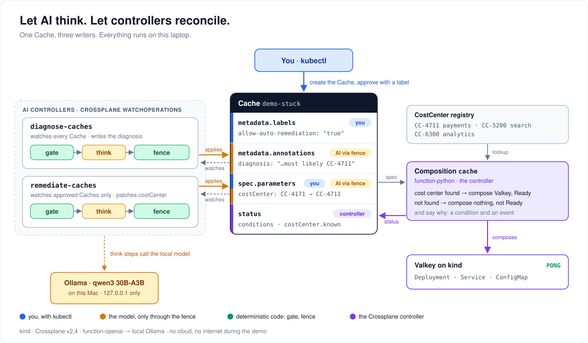

# How it works



## Pieces

- **The Cache API.** `apis/cache/definition.yaml` defines `Cache` (`cache.demo.example.org/v1alpha1`). Its schema requires `costCenter` to match `^CC-[0-9]{4}$`.
- **The composition** (`functions/compose_cache.py`, function-python) looks the cost center up in the CostCenter registry.
  - **Found:** it composes a ConfigMap, a Valkey Deployment and a Service.
  - **Not found:** it composes nothing, sets the `CostCenterResolved=False` condition, emits a Warning event, and explicitly keeps the Cache not Ready. With zero composed resources, Crossplane would otherwise report the Cache as Ready.
  - It writes the known cost centers into `status.costCenter.known`, so the model can see them.
- **Two WatchOperations** (`operations/`) run the pipeline `gate → think → fence`:
  - `diagnose-caches` watches every Cache in `default`.
  - `remediate-caches` watches only Caches labelled `allow-auto-remediation=true`.
- **The model runs on the Mac, not in the cluster.** Ollama is bound to `127.0.0.1:11434`, so it isn't reachable from the venue network, and runs on the Mac's GPU. The kind node reaches the Mac's loopback through colima at `192.168.5.2`, and the in-cluster Service `llm/ollama` points there. `llm/Modelfile` sets the base model plus output-length and context limits, because function-openai sends neither.

## The gate and the fence

Both live in `functions/fence.py` and run in function-python. `demo.sh` appends the mode when it injects the script into each pipeline step.

- **The fence** throws away whatever the AI step produced and rebuilds a minimal server-side-apply patch from an allowlist:
  - **diagnose** may set the diagnosis annotation only.
  - **remediate** may set `spec.parameters.costCenter` only. The code must exist in the registry, the approval label must be present on the live object, and a diagnosis must already be recorded.
  - Anything else (another field, another resource, a different Cache) rejects the whole proposal, with a Warning event on the Cache.
  - The fence owns timestamps and de-duplication. It never fails the Operation: a failed Operation is retried and, under `Forbid`, blocks new runs.
- **The gate** decides whether the model needs to be asked at all. A WatchOperation starts an Operation on every change to the Cache, including Crossplane's own bookkeeping writes, about ten of them while a Cache converges. The model is called only for a settled state that hasn't been explained yet, or for a remediation that is approved, has a recorded diagnosis and has something to fix.
  - Crossplane 2.4 has no "nothing to do" result, so a gate that says no ends the run with a fatal result. Those Operations show as Failed ("failure limit of 1 reached"); nothing is applied, and the model is not called.
  - "State" means `costCenter/sku/CostCenterResolved/Ready`, not the resourceVersion.
- **Staleness.** Crossplane fetches the watched resource separately for each pipeline step, so the fence can see a newer Cache than the model saw. The gate records the state the model is about to see in the pipeline context, and the diagnose fence drops text about a state that has since changed.
- **One model call at a time.** Both WatchOperations use `concurrencyPolicy: Forbid`.
  - With `Replace`, superseded Operations are deleted but their model calls keep running; in testing, bursts of them queued for up to a minute.
  - With `Forbid`, a change that arrives while a run is active is dropped, not queued. The flow doesn't depend on such changes, but the "healthy" re-diagnosis after the fix can be missed. The old diagnosis then stays, stamped (`diagnosed-state`) with the state it describes.
  - The retry option in the guided flow re-triggers by adding a `nudge` annotation.
- **`reset` waits for the Cache to go quiet** (no change for 2 s) before re-applying the WatchOperations, so the first diagnosis isn't competing with Crossplane's bookkeeping writes.
- **RBAC.** Crossplane already has access to ConfigMaps, Deployments, Services, Events and the XRs it defines. The only addition is `registry/rbac.yaml` (read and watch CostCenters), aggregated into Crossplane's role. Both WatchOperations act as Crossplane's service account, so RBAC can't tell them apart: the per-operation scope comes from the fence and the schema.

## Limitations of function-openai v0.3.10, and how the demo handles them

| Limitation | Handled by |
|---|---|
| Only the watched resource reaches the prompt; other required resources are ignored | The composition writes the known cost centers into `status.costCenter.known`, so the controller reports what it observed |
| `html/template` escapes the resource JSON (`"` becomes `&#34;`) | The prompt says so; the prompt text avoids `<`, `>` and `&`; the context is raised to 16k |
| An unparseable reply is silently "success, nothing applied" | The fence reports "no usable proposal" |
| No `max_tokens`, no timeout, no way to switch off thinking | `llm/Modelfile` limits output. The model must not think by default: qwen3.5 does, and burned 2048 tokens on thinking without answering |
| The whole watched object goes into the prompt, `metadata.managedFields` included (57% of it) | About 5,000 tokens per call; the gate keeps calls to two per run |
| The model's output is applied to whatever object it names | The fence checks identity and rejects other objects |

The unreleased branch `fix-selfhosted-issues` of function-openai fixes most of these.

## Tests

`./demo.sh test` runs both suites.

- **Gate and fence unit tests** (`tests/fence/`, 36 tests, run in a Python 3.13 container with the same SDK as function-python):
  - good diagnosis and remediation patches, and a full-object echo
  - a diagnosis that also patches `costCenter`
  - the AI granting itself approval
  - a `sku` change, an unknown cost center, a malformed cost center
  - a proposal touching a Secret, and one touching another Cache
  - no approval, no diagnosis yet, already fixed
  - a deleted Cache, empty model output
  - a fence bug (applies nothing, never fails the Operation)
  - stale snapshots
  - the gate: already diagnosed, converging, bookkeeping-only changes, no approval, no diagnosis, nothing to fix
- **Composition render tests** (`tests/composition/run.sh`, `crossplane composition render`): with and without a matching CostCenter.

## Layout

```
demo.sh                     everything: up, reset, beats, fence, test, rehearse, airplane, down
apis/cache/                 XRD (schema guardrail) and Composition (script injected at build)
functions/compose_cache.py  composition logic (function-python)
functions/fence.py          gate + fence (function-python, MODE appended at build)
operations/                 diagnose-caches and remediate-caches WatchOperations (prompts)
registry/                   CostCenter CRD, three cost centers, RBAC aggregated to Crossplane
llm/                        Modelfile, Ollama Service/EndpointSlice, function-openai Secret
crossplane/                 Helm values (--enable-operations, persistent package cache), functions
cluster/kind.yaml           pinned kind node image
tests/                      fence unit tests, composition render tests, Q&A fence-demo Operations
examples/demo-stuck.yaml    the stuck Cache
docs/                       this page, the stage runbook, the architecture diagram
```

`.tools/` (kind, ollama, asciinema), `.models/` (model weights), `.run/` (logs, timings), `.build/` and `.kubeconfig` are generated and git-ignored. The demo uses its own kubeconfig and never changes your current kubectl context.

## Versions

Crossplane 2.4.2 (Helm chart `crossplane-stable/crossplane`), crossplane CLI 2.5.0, function-python v0.6.0, function-openai v0.3.10, kind v0.33.0 with node v1.36.4, Ollama v0.35.1, Valkey 9.1.2, asciinema 3.2.1.
